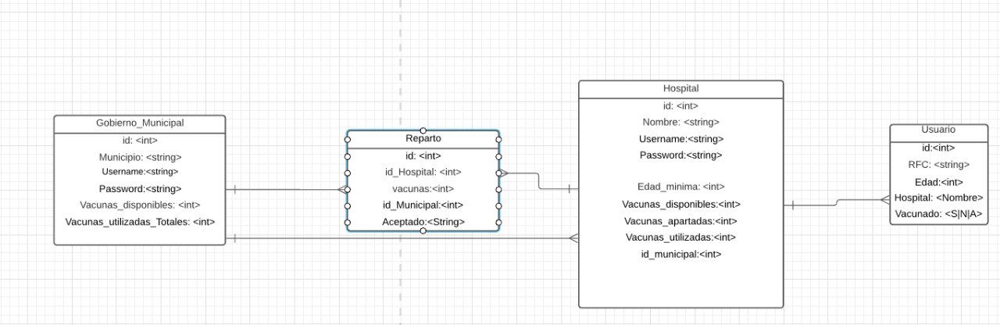

# TC3041 Proyecto Final Invierno 2021

# *[Vacunando a México]*
---

##### Integrantes:
1. *[Antonio Junco de Haas]* - *[A01339695]* - *[CSF]*
2. *[Victor Coeto]* - *[A01654866]* - *[CSF]*
3. *[Jorge Damian Palacios Hristova]* - *[A01654203]* - *[CSF]*

---
## 1. Aspectos generales

Las orientaciones del proyecto se encuentran disponibles en la plataforma **Canvas**.

Este documento es una guía sobre qué información debe entregar como parte del proyecto, qué requerimientos técnicos debe cumplir y la estructura que debe seguir para organizar su entrega.

### 1.1 Requerimientos técnicos

A continuación se mencionan los requerimientos técnicos mínimos del proyecto, favor de tenerlos presente para que cumpla con todos.

* El equipo tiene la libertad de elegir las tecnologías de desarrollo a utilizar en el proyecto.
* El proyecto debe utilizar al menos dos modelos de bases de datos diferentes, de los estudiados en el curso.
* La arquitectura debe ser modular, escalable, con redundancia y alta disponibilidad.
* La arquitectura deberá estar separada claramente por capas (*frontend*, *backend*, *API RESTful*, datos y almacenamiento).
* Los diferentes componentes del proyecto (*frontend*, *backend*, *API RESTful*, bases de datos, entre otros) deberán ejecutarse sobre contenedores [Docker](https://www.docker.com/) o desplegarse en un servicio en la nube.
* Todo el código, *datasets* y la documentación del proyecto debe alojarse en este repositorio de GitHub siguiendo la estructura que aparece a continuación.

### 1.2 Estructura del repositorio
El proyecto debe seguir la siguiente estructura de carpetas:
```
- / 			        # Raíz de todo el proyecto
    - README.md			# Archivo con los datos del proyecto (este archivo)
    - frontend			# Carpeta con la solución del frontend (Web app)
    - api			# Carpeta con la solución de la API o el backend
    - dbs			# Carpeta con los modelos, catálogos y scripts necesarios para generar las bases de datos
    - docs			# Carpeta con la documentación del proyecto
```

### 1.3 Documentación  del proyecto

Como parte de la entrega final del proyecto, se debe incluir la siguiente información:

* Justificación de los modelo de *bases de datos* que seleccionaron.
* Descripción del o los *datasets* y las fuentes de información utilizadas.
* Guía de configuración, instalación y despliegue de la solución.
* Documentación de la API (si aplica). Puede ver un ejemplo en [Swagger](https://swagger.io/). 
* El código debe estar documentado siguiendo los estándares definidos para el lenguaje de programación seleccionado.

## 2. Descripción del proyecto

* El proyecto vacunanado a México consiste en una aplicación en dónde permite llevar acabo un inventario de las vacunas que se usan por municpio y por hospital en la ciudad de México cada municipio cuenta con un número de vacunas que se 
  distribuyen en los hospitales del mismo através de un reparto que se hacen los hospitales, estos cuenta de la misma manera con un inventario de vacunas que se han utilizado, las vacunas disponibles y las vacunas que han sido apartadas 
  para el grupo de edad que se está vacunando, al igual cómo usuario se presenta la opción de registrarse para apartar la vacuna en el hospital que escoja de su municipio, usando su CURP el usuario solo podrá apartar una vacuna 
  si el hospital esta vacunando a las personas de su edad si no tendrá que esperar a que eso cambie. 

### 2.1 Casos de negocio 
    Para este proyecto se tomaron en cuenta los siguientes casos de negocio:

        * El inicio de sesión de Hospital y Gobierno al igual que el registro de cada uno 
        * El reparto de vacunas por parte del Gobierno hacia los Hospitales de su localidad 
        * Los hospitales tienen un inventario con sus vacunas utilizadas, disponiples ya apartadas y pueden acepatar el reparto que hace el gobierno sumandolas a las vacunas disponibles.
        * Los usuarios tienen la opción de llenar una forma para apartar una vacuna 

## 3. Solución

A continuación aparecen descritos los diferentes elementos que forman parte de la solución del proyecto.


### 3.1 Modelos de *bases de datos* utilizados

* Para la solución de este proyecto se utilizo mongodb para almacenar los gobiernos, hospitales, el reparto que se hace de las vacunas y un registro de los usuarios que hacen un aparatdo de la vacuna, el modelo se presenta a continuación de 
cómo está estructurada la base de datos en la parte de Mongodb :

 

* Se escogió esta base de datos debido  a que es una base de datos NoSQL que es de las más usadas y permite la integración con otras bases de datos, de igual manera permite manejar grandes cantidades de datos y este tipo de base de datos no
  necesita un modelo entidad relación lo cual hace más sencillo a la hora de inserta información en las diferentes colecciones y permite hacer relaciones de mejor forma con las diferentes colecciones y de la misma manera permite hacer consultas optimizadas
  al igual que tiene una gran capacidad de escalabilidad. 
  
* La segunda base de datos que se escogió fue Redis la principal función es mantener la sesión del usuario iniciada durante un tiempo específico, se escogió redis debido a dos facotres lo sencillo que es ingresar una llave valor y crearle un tiempo
  para que expire la sesión y la cierre automáticamente despues de que esa llave expire.  

### 3.2 Arquitectura de la solución

*[Incluya aquí un diagrama donde se aprecie la arquitectura de la solución propuesta, así como la interacción entre los diferentes componentes de la misma.]*

### 3.3 Frontend

*[Incluya aquí una explicación de la solución utilizada para el frontend del proyecto. No olvide incluir las ligas o referencias donde se puede encontrar información de los lenguajes de programación, frameworks y librerías utilizadas.]*

#### 3.3.1 Lenguaje de programación
El usuario interactua con html, el cual se comunicará con python para ejecutar funciones

#### 3.3.2 Framework
El framework que se usa es Flask

#### 3.3.3 Librerías de funciones o dependencias
* Flask.- el framework de donde vienen las dependecias para hacer la parte web de la aplicación
* jsonify.- Para objetos json 
* request. -pedir template 
* redirect.- mover al usuario entre los templates 
* render_template.- cargar el html 
* url_for.- llamar las funciones de python en html
* session.- crear sesiones y guardar sus datos
* MongoClient.-  Conexión con mongodb
* pymongo .- Conexión con mognodb y sus operaciones dentro de él 
* ObjectId. - Se usa para identificar los objetos en html
* bycript. - Hash de passwords 
* os.- manipular los archivos.

### 3.4 API o backend

Para este proyecto se decidió usar Python y usar el framework de Flask ya que permite hacer un aplicación wenb e integrar dos bases de datos en sencillo en la parte del backend lo cual nos permite trabajar de forma más eficiente a la hora 
de programar la aplicación.

#### 3.4.1 Lenguaje de programación
El lenguaje que se utilizo para la arquitectura se uso Python. 

#### 3.4.2 Framework
El framework que se usa es Flask 

#### 3.4.3 Librerías de funciones o dependencias

* Flask.- el framework de donde vienen las dependecias para hacer la parte web de la aplicación
* jsonify.- Para objetos json 
* request. -pedir template 
* redirect.- mover al usuario entre los templates 
* render_template.- cargar el html 
* url_for.- llamar las funciones de python en html
* session.- crear sesiones y guardar sus datos
* MongoClient.-  Conexión con mongodb
* pymongo .- Conexión con mognodb y sus operaciones dentro de él 
* ObjectId. - Se usa para identificar los objetos en html
* bycript. - Hash de passwords 
* os.- manipular los archivos.

Hay tres tipos de endpoint
* Gobienro: backend, inicia sesion en el url "/" y puede registrarse o iniciar sesión. Una vez iniciada puede mandar vacunas a los hospitales.
* Hospital: backend, inicia sesion en el url "/hospital" y puede registrarse o iniciar sesión. Una vez iniciada puede aceptar vacunas enviadas, y confirmar/borrar los usuarios vacunados/no vacunados.
* Usuario: frontend, se registra en el url "/registrar_usuario"

## 3.5 Pasos a seguir para utilizar el proyecto
Hay 2 formas de usar el proyecto:

- De forma local
  
Para poder usar el proyecto de forma local se necesita tener instalado python3, tener pip para jalar las librerias y git para clonar el repositorio. 
Primero tienes que crear clonar el repositorio. todos estos comandos los puedes encontrar en la página oficial de [Flask](https://flask.palletsprojects.com/en/1.1.x/installation/), si quieres activarlo en windows encontraras los comandos para hacerlo. 
~~~
git clone https://github.com/tec-csf/tc3041-pf-invierno-2021-eq2
~~~
Ya que tenemos copiado el repositorio tenemos que entrar a la carpeta en donde se encuentra toda nuestra API, tenemos que hacer:
~~~
cd api/Flask_mongo
~~~

Tras entrar la carpeta tienes que crear un ambiente virtual de flask para poder hacer la aplicación localmente, el primer comando creará las instanicas y el segundo activará el ambiente. 
~~~
python3 -m venv venv
. venv/bin/activate
~~~
ahora dentro del ambiente se necesita instalar a través de pip las librerias de flask y el resto que necesita instalar. 
~~~
pip install -r requirements.txt
~~~
Ahora solo falta decir que el programa main es con el que va a exportar la aplicación, se hace con el comando:
~~~
export FLASK_APP=main.py
~~~
Ya tienes todo instalado y listo para correr, ahora solo tienes que hacer que corra flask y tendras la aplicación corriendo en la IP que te da el mismo comando (http://127.0.0.1:5000/)
~~~
flask run
~~~

- de forma remota

Ingrese al siguiente [link](https://proyectofinal-303717.rj.r.appspot.com/inicio) para ver el proyecto desde google app engine.

## 4. Referencias

* Algunos sitios que fueron usados para este proyecto fueron los siguientes: 

* https://flask.palletsprojects.com/en/1.1.x/patterns/flashing/ 

* https://www.youtube.com/watch?v=vVx1737auSE

* https://flask-pymongo.readthedocs.io/en/latest/

* https://dev.to/paurakhsharma/flask-rest-api-part-1-using-mongodb-with-flask-3g7d 

* https://cloud.google.com/memorystore/docs/redis/connect-redis-instance-standard?hl=es-419#python

* https://medium.com/@dmahugh_70618/deploying-a-flask-app-to-google-app-engine-faa883b5ffab

* https://www.freecodecamp.org/news/how-to-build-a-web-app-using-pythons-flask-and-google-app-engine-52b1bb82b221/

* https://hackersandslackers.com/managing-user-session-variables-with-flask-sessions-and-redis/


